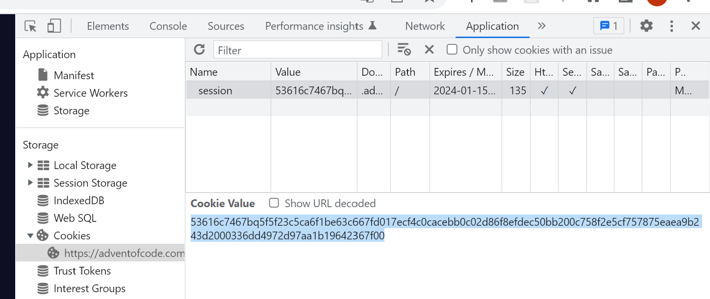

# aoc-kit
`aoc-kit` is a Node library / CLI built for **Advent of Code**. It takes care of downloading your specific program input for each task and enables automatic submission of your answers.

## Installation
To install `aoc-kit` into your project, use your preferred package manger. In case of `npm`, run the following command:
```
npm install aoc-kit
```
This will allow you to import the `defineSolution()` method from within your code. However, you still need a way to run the CLI itself. You can do this by also installing the `aoc-kit` package globally after which you'll be able to execute commands by running:
```
aoc-kit [command] [args]
```

Alternatively, you can execute these commands without installing the package globally by prefixing them with `npx` and running them inside your project directory (e.g. `npx aoc-kit run index.js`).

## Configuration
While there are multiple features of this tool that are able to function anonymously, the actual download of your custom input and submission of your answers will require authentication of your **Advent of Code** account.

In order to do that, you'll first need to obtain your session token. Start by visiting the official **AoC** [website](https://adventofcode.com/) in your browser and logging into your account. Once logged in, inspect the website's cookies in your browser's developer tools. There, you should be able to see a cookie named `session`. Its value is the session token you're looking for.

|  |
|:---:|
| *Session token example in Chrome DevTools* |

Once you have the token, authenticate your account in the CLI by running:
```
aoc-kit login [token]
```

Analogically, you can also run `aoc-kit logout` to remove your account's authentication from the CLI.

## Usage
When writing a solution, start by creating a `.js` (or `.mjs`) file with the following contents:
```js
import { defineSolution } from 'aoc-kit';

export default defineSolution((input, solve, config) => {}, {});
```

Let's start off by focusing on the second argument of our `defineSolution()` method. This argument is a configuration object for how the CLI is supposed to behave while executing our code and is entirely optional as well as any of its properties. The supported properties are:

| property | type | description |
| --- | --- | --- |
| **mode** | `'text' \| 'lines' \| 'numbers'`| Sets up how the input is pre-processed before being passed to your solution. In `text` mode, it is passed directly as a `string`. In `lines` mode, the content gets split by lines and passed in the form of a `string[]`. `numbers` mode works similarly to `lines` mode but each line also gets automatically converted into a number. In this case, the input is of type `number[]`. |
| **example** | `boolean` | If set to true, the program isn't going to use your actual input for the given task but the example given on the AoC website instead. This is useful for development and debugging and does not required account authentication. It's not possible to submit an answer while using the example input. Defaults to `false`. |
| **year** | `number` | The year of **AoC** we're writing a solution for. Defaults to whatever is currently the latest year of **AoC**. |
| **day** | `number` | The day of **AoC** we're writing a solution for. Accepts values from `1` to `25`. |
| **part** | `number` | Part of the specified day of **AoC** we're writing a solution for. Accepts values `1` or `2`. |

Most of these properties can also be set in the form of a CLI argument, instead of making them part of the JS code *(more in the **CLI Options** section)*. If the same property is set in both places, the CLI argument serves as an override.

Now let's take a look at the first argument of the `defineSolution()` method. This one is a function whose body will contain our actual solution to the given task and it takes different 3 arguments. The first one named `input` contains the input data for the task and is either of type `string` or `string[]`, depending on the `lines` property of our configuration object as described above.

The second argument is a function called `solve()`. This is a function we'll most likely be calling at the very end of our solution's code and its argument is the value we desire to submit as our final answer. The argument can either be of type `string` or `number`. This function must be called exactly once during the execution of our solution.

The last argument is an object named `config`. This object contains the entire configuration of the CLI during this execution. It combines values from the configuration object passed into the `defineSolution()` method as well as any overrides cause by additional CLI arguments. Its properties are mostly the same as in the case of the configuration object with the exception of a new `input` property of type `string | null` which contains the value passed with the `--input` flag of the CLI *(more in the **CLI Options** section)*.

## CLI Options
| Command | Description |
| --- | --- |
| <code>aoc‑kit&nbsp;login&nbsp;[token]</code> | Authenticates user account with the CLI *(more in the **Configuration** section)* |
| <code>aoc‑kit&nbsp;run&nbsp;[src_file]</code> | Executes the specified solution but only prints the answer. It doesn't try submitting it to the **AoC** server. Use this command during development. Additional flags for this command specified beflow. |
| <code>aoc‑kit&nbsp;submit&nbsp;[src_file]</code> | Executes the specified solution and submits the answer to the **AoC** server. Additional flags for this command specified beflow. |
| <code>aoc‑kit&nbsp;logout</code> | Logs user out from the CLI *(more in the **Configuration** section)* |
| <code>aoc‑kit&nbsp;clear</code> | Clears all data stored by `aoc-kit` (input file cache and login information) |

&nbsp;

CLI flags for the `aoc-kit run` and `aoc-kit submit` comnmands:
| Flag | Argument | Description |
| --- | --- | --- |
| `‑‑year`, `‑y` | number | Override for the `year` property of the configuration object *(more in the **Usage** section)* |
| `‑‑day`, `‑d` | number | Override for the `day` property of the configuration object *(more in the **Usage** section)* |
| `‑‑part`, `‑p` | number | Override for the `part` property of the configuration object *(more in the **Usage** section)* |
| `‑‑example`, `‑e` | *‑none‑* | Override for the `example` property of the configuration object *(more in the **Usage** section)*. This flag doesn't take an argument. It's presence sets the `example` property to `true`. This flag cannot be used with `aoc‑kit submit`. |
| `‑‑input`, `‑i` | filepath | When this flag is set, the CLI loads input for the task from a specified file (path relative to the working directory of your terminal). This flag cannot be used with `aoc‑kit submit`. When this flag is set, the `example` property is ignored and the `day` and `part` properties don't have to be set. |

## Example
`main.js`**:**
```js
import { defineSolution } from 'aoc-kit';

// Sums up all numbers in the input
export default defineSolution((input, solve) => {
  const nums = input.map(x => Number(x));
  const sum = nums.reduce((acc, x) => x + acc, 0);
  solve(sum);
}, { mode: 'lines' });
```

**Terminal:**
<pre><code><strong>$</strong> aoc-kit submit -y 1984 -d 3 -p 1 main.js
√ Input fetched from network
√ Solution module loaded
► Your answer: 4726
------------------------------------------
√ Solution successfully submitted
√ Your answer was CORRECT

✶ DAY 3 (Part 1) OF 1984 COMPLETED ✶
</code></pre>

## License
MIT
